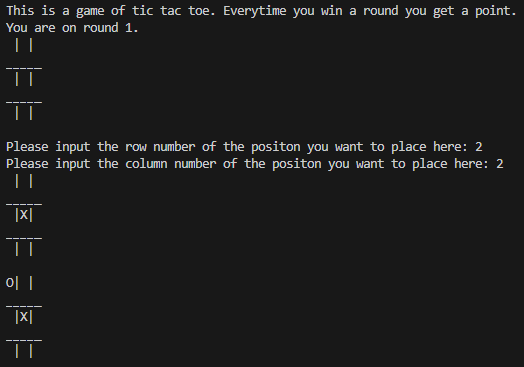

# High Score Tracker
***

Our project is a program mainly centered around being able to read, edit and save in other files.
The main goal was to be able to save user's high scores, and then be able to edit the high scores when a new score is created. 
The scores were obtained from playing simple games, like tic tac toe and a number guessing game.
To be able to access all the high scores, the user is able to create an account and sign in later. This information is also saved in its own file.
The user is able to sign in, play the mini games, view their high scores, and sign out.

## How to use
***
1. Go to the file called main in the 'src' folder
2. Hit the run button (It looks like YouTubes triangle logo)

## Details on project features
***
- High scores saved in CSVs
- User log in information also saved in CSVs
- User passwords are hashed using python's hashlib library
- An Admin capablity where they are able to log in and mange users
- Can view personal high scores as well as overall high scores between all users
- 

## Contributers
***
- abstudent133
- lulu094
- Lizzie42-SandersonFan
- IsCowdell